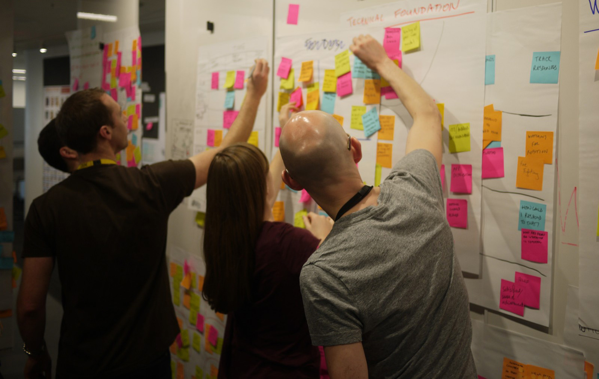

## Design Thinking
Design workshops allow Emerging Technology developers and designers to work with you on a specific user problem. We use IBM's <a href="https://www.ibm.com/design/thinking/">Design Thinking</a> process to understand user needs and develop solutions to meet them. A design workshop is completely focussed around users. They are hands-on sessions that encourage empathy towards users and are often responsible for generating new ideas or solutions.

*Image: [Nick O'Leary](https://www.flickr.com/photos/knolleary/15572623342/in/album-72157648445616348/)*

The Emerging Technology team have experience of applying Design Thinking to real problems, but are also skilled technologists. Their background technical knowledge often allows them to propose novel solutions. You input expert industry knowledge and understanding of the target user.

## What we Offer
Emerging Technology will facilitate and run a client design workshop. We can host the workshop at our [Hursley lab](http://www-05.ibm.com/uk/locations/hursley.html) or run it on a client site.

The format of a design workshop will be tailored to you. They are typically two days long, though they can be shorter or longer depending on the scope of the problem to be addressed. The output of each workshop will be different, but can include: maps of the user persona and problems, documented ideas, feasibility assessments and prototypes.

A design workshop is best applied when there is a specific user problem to be addressed. You will need detailed knowledge about the problem and users, but not necessarily any development expertise.

## A Design Workshop looks like...
Before the workshop one of our technologists will work with you to design the days, helping to identify the users and problems that are to be tackled and making sure the right people are involved. We normally start a workshop by giving a brief introduction to the Design Thinking process and what lies ahead over the two days. We then invite you to give some background and set the scene for the problem we'll be working on.

After the introductions, we jump in to mapping out our user's persona, giving them a name and identifying what they're doing, saying, thinking and feeling. This is done in small groups on Post-It notes around a board, it gets everyone involved and allows us to capture everyone's input. This sets us up how we'll work for the rest of the workshop. We continue in the same style to identify the tasks that the user is trying to complete, recoding problems, coming up with ideas to solve them and describing what the solution will look like, all from the user's point of view.

At the end of two days of designing we'll have worked our way through piles of Post-It notes, problems, ideas and solutions. We'll capture and document the activities that we've progressed though and come together to plan what a minimum next step would be to develop the solutions we've designed.

## Get in touch or find out more
If you're interested in running a design workshop or want to find out more, contact [Darren Shaw](mailto:shawdm@uk.ibm.com).
